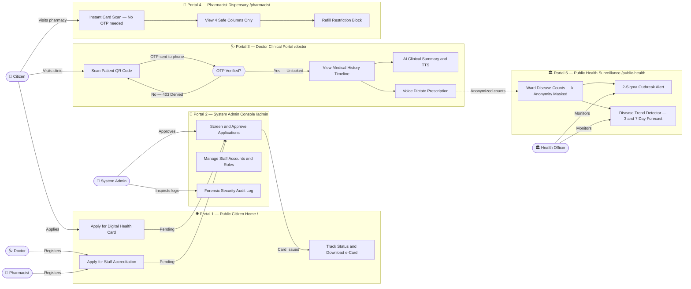
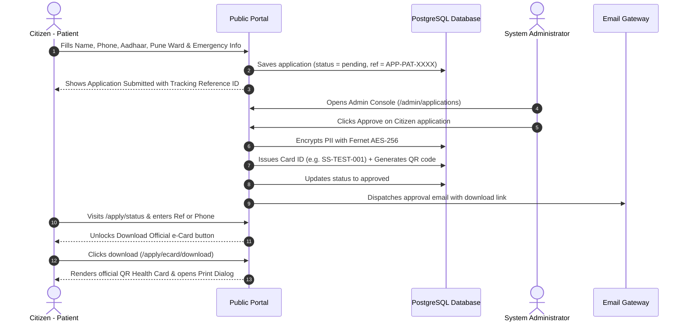
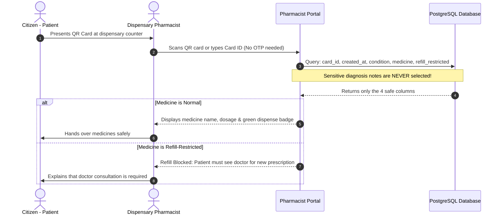
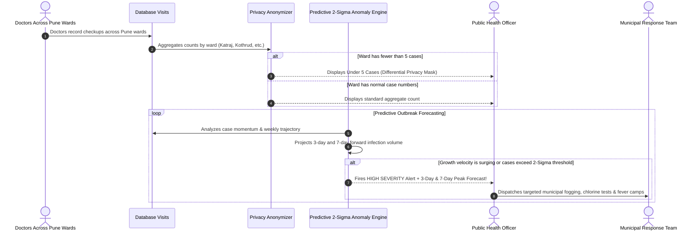

# 🏥 Swasthya Setu (स्वास्थ्य सेतु)
### Unified Healthcare Network, Complete Panel Guide & Security Blueprint

> 💡 **New here and want to run the project right now?**  
> ➔ Jump straight to the setup guide: **[SETUP_AND_DEMO_GUIDE.md](SETUP_AND_DEMO_GUIDE.md)**  
> *(Has installation commands, all demo passwords `password123`, and outbreak simulator steps!)*

---

## 🎯 Executive Briefing for Hackathon Judges & Evaluators

Welcome, Judges! Here is a 60-second summary of what **Swasthya Setu** delivers, why it matters, and where it is going during the hackathon:

```
┌────────────────────────────────────────────────────────────────────────┐
│                   HACKATHON EVALUATION SCORECARD                       │
├─────────────────────┬──────────────────────────────────────────────────┤
│ Problem Solved      │ Fragmented paper records, unauthorized snooping, │
│                     │ prescription errors & delayed epidemic response. │
├─────────────────────┼──────────────────────────────────────────────────┤
│ Core Innovation     │ Zero-Trust Patient Physical Consent (OTP gate) + │
│                     │ Voice-to-Prescription + 2-Sigma Outbreak Radar.  │
├─────────────────────┼──────────────────────────────────────────────────┤
│ Production Security │ Fernet AES-256 PII, RBAC 403, Immutable Audit,   │
│                     │ Rate Limiter (429), k-Anonymity (< 5 masking).   │
├─────────────────────┼──────────────────────────────────────────────────┤
│ AI/ML Status        │ • Live Prototype: Google Gemini 1.5 LLM + RapidFuzz│
│                     │ • Hackathon Sprint: Transitioning to sovereign,  │
│                     │   on-premise/edge AI/ML models (see Section 6).  │
├─────────────────────┼──────────────────────────────────────────────────┤
│ Live Demo Script    │ See SETUP_AND_DEMO_GUIDE.md for 5-minute flow.   │
└─────────────────────┴──────────────────────────────────────────────────┘
```

> ⚠️ **Important AI/ML Architectural Note**:  
> For this prototype, **Google Gemini API** is integrated as a **temporary evaluation model** for clinical summarization and voice transcript parsing.  
> **During our 24-Hour Hackathon Sprint**, we are actively transitioning to **self-hosted, sovereign open-source AI/ML models** (such as BioMistral / Llama-3-Med via Ollama/GGUF, fine-tuned Whisper for Indian multilingual medical accents, and ML time-series forecasting). This ensures 100% compliance with India's **DPDP Act & DISHA regulations**, meaning sensitive patient health data never leaves the hospital's local network. *(See [Section 6](#-aiml-architecture--24-hour-hackathon-roadmap) for full details).*

---

## 🌟 Table of Contents
1. [What is Swasthya Setu? (In Simple Words)](#-what-is-swasthya-setu-in-simple-words)
2. [How the Whole System Works (Master Flowchart)](#-how-the-whole-system-works-master-flowchart)
3. [The 5 Portals: What Each Panel Does & How to Use It](#-the-5-portals-what-each-panel-does--how-to-use-it)
   - [Portal 1: Public Citizen Home (`/`)](#portal-1-public-citizen-home-)
   - [Portal 2: Doctor Clinical Portal (`/doctor`)](#portal-2-doctor-clinical-portal-doctor)
   - [Portal 3: Pharmacist Dispensing Portal (`/pharmacist`)](#portal-3-pharmacist-dispensing-portal-pharmacist)
   - [Portal 4: Public Health Outbreak Radar & Disease Trend Detector (`/public-health`)](#portal-4-public-health-outbreak-radar-public-health)
   - [Portal 5: System Admin Control Room (`/admin`)](#portal-5-system-admin-control-room-admin)
4. [Step-by-Step Visual Flowcharts for Key Workflows](#-step-by-step-visual-flowcharts-for-key-workflows)
   - [A. Citizen Health Card Application & Download Flow](#a-citizen-health-card-application--download-flow)
   - [B. Doctor Visit, OTP Consent & AI Prescription Flow](#b-doctor-visit-otp-consent--ai-prescription-flow)
   - [C. Pharmacist Safe Dispensing Flow](#c-pharmacist-safe-dispensing-flow)
   - [D. Disease Outbreak Surveillance & Alert Flow](#d-disease-outbreak-surveillance--alert-flow)
5. [Security Made Simple: Every Protection Explained](#-security-made-simple-every-protection-explained)
6. [AI/ML Architecture & 24-Hour Hackathon Roadmap](#-aiml-architecture--24-hour-hackathon-roadmap)
7. [Quick Reference & Documentation Links](#-quick-reference--documentation-links)

---

## 📖 What is Swasthya Setu? (In Simple Words)

Imagine visiting a new doctor in your city. Usually, you have to carry a heavy plastic folder with old paper prescriptions, lab reports from years ago, and handwritten doctor notes that no one can read. If you lose that folder, your medical history is lost forever.

Now imagine the opposite problem: if all your private medical records are placed online, what stops an unauthorized person, a chemist, or a random clerk from snooping into your sensitive medical illnesses?

**Swasthya Setu ("Bridge of Health")** is built for the **Pune Metropolitan Region** to solve both problems at once:

1. **For Citizens**: You apply online for an official **Digital Health Card** with a unique QR code. You can carry it on your phone or print it like an Aadhaar card.
2. **For Doctors**: When you visit a clinic, the doctor scans your card's QR code. But **the doctor cannot see your records yet**! You receive a secret 6-digit OTP on your phone. Only when you tell the doctor that OTP does your health history unlock. The doctor gets an **AI summary** of your health, can speak prescriptions out loud using **Voice Dictation**, and gets instant alerts if a drug name is misspelled.
3. **For Pharmacists**: The chemist scans your card and sees **only** what medicines to give you. They can **never** see your confidential doctor notes, and if a medicine has a refill restriction, the computer blocks it.
4. **For Government Health Officers**: An automated surveillance radar watches disease counts across Pune (Katraj, Kothrud, Hadapsar, etc.). If Dengue or Flu suddenly spikes, an **Outbreak Alert** fires automatically so the municipality can send fogging and medical teams.
5. **For System Admins**: A central control room to verify doctor licenses, approve citizen cards, and watch a tamper-proof security log of every single action taken on the website.

---

## 🗺️ How the Whole System Works (Master Flowchart)

Here is a simple, high-level map showing how citizens, doctors, pharmacists, health officers, and system admins interact:



> **How to read the diagram:** Actors (circles) on the left connect to the portal that serves them. Dashed arrows show background data flows (doctor checkups feed the surveillance engine). The diamond shape on the Doctor portal is the security checkpoint — no OTP, no access.


---

## 💻 The 5 Portals: What Each Panel Does & How to Use It

---

### Portal 1: Public Citizen Home (`/`)
*The friendly front door of the municipal health network.*

```
┌─────────────────────────────────────────────────────────────────────────┐
│                     PUBLIC PORTAL (Landing Page)                        │
├───────────────────────────────────┬─────────────────────────────────────┤
│ 🪪 Citizen Health Card Application│ 🩺 Healthcare Staff Accreditation   │
│   • Enter Name, Phone, Aadhaar    │   • For Doctors & Pharmacists       │
│   • Emergency Contact & Blood Grp │   • Submit MMC/MSPC License No.     │
│   • Choose your Pune Locality     │   • Submit Hospital & Experience    │
│   • Get Reference Tracking ID     │   • Reviewed by System Admin        │
├───────────────────────────────────┴─────────────────────────────────────┤
│ 🔍 Track Application Status & Download Official Digital e-Card          │
│ 🔐 Staff Login Button (takes doctors, pharmacists & admins to work)     │
└─────────────────────────────────────────────────────────────────────────┘
```

#### What can you do here?
1. **Apply for a Digital Health Card (`/apply/health-card`)**:
   * Anyone living in Pune can fill this simple online form.
   * You enter basic information: Name, Phone, Date of Birth, Gender, Blood Group, Government ID (Aadhaar/PAN/Voter ID), Pune Locality (Katraj, Kothrud, Shivajinagar, Hadapsar, etc.), and Emergency Contact.
   * You can also note chronic conditions (like Diabetes or Asthma) and any known drug allergies.
   * When you submit, the computer gives you an instant tracking reference number like `APP-PAT-2026-0001`.
2. **Apply for Healthcare Staff Accreditation (`/apply/staff`)**:
   * Doctors and Pharmacists practicing in Pune use this page to join the network.
   * They enter their Medical Council (MMC) or Pharmacy Council (MSPC) license number, medical qualification (MBBS, MD, B.Pharm), clinical specialty, and hospital/clinic address.
   * Once submitted, it gets routed to the System Administrator for official verification.
3. **Track Application Status (`/apply/status`)**:
   * Type in your application reference number or your registered mobile phone number.
   * The system shows your real-time status: **Pending Review**, **Approved**, or **Rejected** (with the administrator's reason).
4. **Download & Print Your Official Digital e-Card (`/apply/ecard/download`)**:
   * Once approved, a green **Download Official e-Card** button appears!
   * Clicking it opens a beautifully formatted Pune Municipal Corporation Health Card complete with your unique Card ID (`SS-...`), personal details, blood group, emergency numbers, and your encrypted QR code.
   * The page automatically triggers your browser's print dialog so you can print it or save it as a PDF immediately.
5. **Staff Login (`/login`)**:
   * A dedicated button in the header for staff. Once a doctor, pharmacist, health officer, or admin logs in, the website automatically recognizes their role and sends them directly to their specific dashboard.

---

### Portal 2: Doctor Clinical Portal (`/doctor`)
*The smart clinical workspace for attending physicians.*

```
┌─────────────────────────────────────────────────────────────────────────┐
│                       DOCTOR CLINICAL WORKSPACE                         │
├────────────────────────────┬────────────────────────────────────────────┤
│ 📷 Camera QR Scanner       │ 🔐 2-Factor Patient Physical Consent (OTP) │
│    Point camera at patient │    Patient receives 6-digit OTP on phone   │
│    card or type ID         │    Guarantees patient is physically present│
├────────────────────────────┴────────────────────────────────────────────┤
│ 📋 Patient Timeline & AI Clinical Briefing                              │
│    • Plain English AI summary of entire medical history (~60 words)     │
│    • 🔊 "Read Summary" button plays summary aloud via speech            │
│    • Full past history of visits, diagnoses, and past medicines         │
├─────────────────────────────────────────────────────────────────────────┤
│ ✍️ Add New Checkup (Typing OR Hands-Free Voice Dictation)               │
│    • 🎙 "Voice Dictate" button: speak diagnosis naturally into mic      │
│    • RapidFuzz Drug Checker: corrects spelling & flags drug allergies   │
│    • Refill Restriction switch: prevents unauthorized repeats           │
│    • Strict 24-Hour Edit Lock: doctor can edit own recent note for 24h, │
│      after that it becomes permanently locked and immutable.            │
└─────────────────────────────────────────────────────────────────────────┘
```

#### What can you do here?
1. **Scan Patient QR Code (`/doctor/scan`)**:
   * Opens the doctor's webcam or mobile phone camera.
   * Point it at the patient's digital health card to scan the QR code. You can also manually type the Card ID (e.g. `SS-TEST-001`).
2. **Verify Patient Physical Consent (`/doctor/otp-verify`)**:
   * The moment the card is scanned, the server generates a secret 6-digit OTP and sends it directly to the patient's phone (and email).
   * The doctor asks the patient for the code and enters it.
   * **Why this matters**: A doctor cannot look at a patient's private medical past unless the patient is sitting in the room and gives their consent!
3. **View Longitudinal Medical History (`/doctor/patient/<id>/history`)**:
   * Once verified, the doctor sees all past hospital visits, past illnesses, and previous medications in chronological order.
4. **Read & Listen to the AI Clinical Summary**:
   * Instead of reading 10 pages of messy notes, the AI summarizer reads the history and gives the doctor a crisp ~60-word clinical overview.
   * Doctors can click **"🔊 Read summary"** to listen to the summary aloud while examining the patient.
5. **Add a Checkup with Voice Dictation (`/doctor/patient/<id>/add-checkup`)**:
   * **Typing method**: Fill in diagnosis, area, medications, and dosage manually.
   * **Voice method**: Click the **"🎙 Voice"** button and speak naturally: *"Patient has high fever and acute sore throat. Prescribe Paracetamol 650mg three times daily and Azithromycin 500mg for 3 days."*
   * The computer turns speech to text, parses the medical fields, and fills the form automatically!
6. **Smart Drug Spelling & Allergy Checker**:
   * As medicines are typed, the system checks against a 500+ Indian drug catalog. If you mistype *"paracetmol"*, it suggests *"Paracetamol"*. If the medicine conflicts with known patient allergies, a warning pops up immediately.
7. **24-Hour Mistake Window (`/doctor/visit/<id>/delete`)**:
   * If a doctor makes a typing mistake on a visit they just created, they can delete and re-enter it within 24 hours.
   * After 24 hours, the record locks permanently to prevent medical record tampering. Another doctor can **never** delete another physician's entries.

---

### Portal 3: Pharmacist Dispensing Portal (`/pharmacist`)
*The fast, safe, privacy-preserving dispensary counter.*

```
┌─────────────────────────────────────────────────────────────────────────┐
│                      PHARMACIST DISPENSING COUNTER                      │
├─────────────────────────────────────────────────────────────────────────┤
│ 🔍 Instant Card Scan (No OTP needed — prevents long lines at chemist)   │
├─────────────────────────────────────────────────────────────────────────┤
│ 🔒 Privacy Guarantee: Chemist sees ONLY 4 Columns:                      │
│    1. Card ID        2. Date of Visit                                   │
│    3. Condition      4. Prescribed Medicine & Dosage                    │
│    ⚠️ Sensitive Doctor Diagnosis Notes are NEVER fetched from database! │
├─────────────────────────────────────────────────────────────────────────┤
│ 🚫 Refill Protection:                                                   │
│    If marked "Refill Restricted", item is highlighted with a warning:   │
│    "Refill Blocked — Patient must consult doctor for new prescription"  │
├─────────────────────────────────────────────────────────────────────────┤
│ 🛡️ View-Only Mode: Pharmacists cannot alter, edit, or delete any record│
└─────────────────────────────────────────────────────────────────────────┘
```

#### What can you do here?
1. **Instant QR or Card ID Scan (`/pharmacist/scan`)**:
   * The chemist scans the patient's card or enters their Card ID.
   * There is **no OTP step** here so medicines can be dispensed quickly without making sick patients wait in line.
2. **Restricted Medicine View (`/pharmacist/patient/<id>/medicines`)**:
   * The chemist sees the exact list of prescribed medicines, dosages, and instructions.
   * **Strict Privacy Rule**: The database query is programmed to retrieve **only 4 fields**. The patient's confidential clinical examination notes (`diagnosis_notes`) are **never fetched** from the database.
3. **Refill Restricted Block**:
   * If a doctor marked a medication as habit-forming, dangerous, or restricted (e.g., sleeping pills or strong antibiotics), the system marks it in red with a clear blockage: *"Refill Blocked — Doctor consultation required"*.
4. **Zero-Tampering Guarantee**:
   * The pharmacist panel is completely view-only. There are no delete, create, or edit buttons.

---

### Portal 4: Public Health Outbreak Radar (`/public-health`)
*The municipal early-warning system for epidemics.*

```
┌─────────────────────────────────────────────────────────────────────────┐
│          PUBLIC HEALTH SURVEILLANCE, OUTBREAK RADAR & TREND DETECTOR    │
├─────────────────────────────────────────────────────────────────────────┤
│ 🗺️ Ward-by-Ward Disease Monitoring (Katraj, Kothrud, Hadapsar, etc.)    │
│    Tracks weekly cases of Dengue, Malaria, Typhoid, Viral Flu, etc.    │
├─────────────────────────────────────────────────────────────────────────┤
│ 🛡️ k-Anonymity Privacy Filter:                                          │
│    If fewer than 5 people in a ward have an illness:                    │
│    The number is hidden and displays: "< 5 (Insufficient Data)"         │
│    Nobody can figure out individual patient identities!                 │
├─────────────────────────────────────────────────────────────────────────┤
│ 🚨 Automated 2-Sigma Outbreak Detector (/public-health/trend-alerts)    │
│    Math engine checks if current cases exceed average+2*std_deviation   │
│    Triggers bright red HIGH SEVERITY Alert with municipal actions:      │
│    • Mosquito fogging  • Water testing  • Emergency fever clinics       │
├─────────────────────────────────────────────────────────────────────────┤
│ 📈 NEW: Disease Trend Detector (/public-health/trend-forecast)          │
│    Shows ALL monitored conditions — not just those already spiking!     │
│    Colour-coded risk cards updated in real time:                        │
│    🔴 CRITICAL  🟠 ELEVATED  🟡 WATCH  🔵 STABLE  🟢 RECEDING          │
│    3-Day & 7-Day case projections give 3–7 days advance warning         │
└─────────────────────────────────────────────────────────────────────────┘
```

#### What can you do here?
1. **City Epidemiological Dashboard (`/public-health/dashboard`)**:
   * Health officers can filter disease counts by Pune area (Katraj, Kothrud, Shivajinagar, etc.), by condition (Dengue, Flu, Gastro), and by time period.
   * **Zero Patient Information**: Health officers see aggregate numbers only. Not a single patient name, phone number, or card ID exists on this dashboard.
2. **Differential Privacy & k-Anonymity Masking**:
   * What if only 2 people in Katraj have a rare illness? If the screen showed "2", neighbors might guess who those 2 patients are!
   * To prevent this, if any group has fewer than 5 cases, the system replaces the number with:  
     `"Under 5 (Insufficient Data)"`.
3. **Automated 2-Sigma Outbreak Anomaly Alerts (`/public-health/trend-alerts`)**:
   * An intelligent statistical engine compares this week's cases against recent historical weeks.
   * If cases spike past the statistical threshold ($\mu + 2\sigma$), the dashboard automatically displays a **HIGH SEVERITY Outbreak Alert**.
4. **Predictive Disease Spread & Spike Forecaster (Predicting Spikes 3 to 7 Days in Advance)**:
   * **Momentum & Velocity Analysis**: Calculates week-over-week case velocity ($\Delta C / \Delta t$) and classifies spread into `STABLE`, `MODERATE INFLUX`, `HIGH SPREAD VELOCITY`, or `EXPONENTIAL SURGE`.
   * **3-Day & 7-Day Forward Projections**: Instead of waiting for hospitals to overflow, the algorithm projects case numbers 3 to 7 days ahead (e.g. *'Katraj Dengue: Currently 37 cases, projected to reach ~54 cases within 72 hours with peak window in ~3-5 days'*).
   * **Actionable Municipal Playbooks**: Recommends targeted municipal emergency responses (e.g. vector control fogging, residual chlorine water tests, mobile fever clinics) to intervene *before* the epidemic peaks.
5. **NEW: Disease Trend Detector — All-Conditions Proactive Forecaster (`/public-health/trend-forecast`)**:
   * This is the **advance-warning radar** that goes *beyond* outbreak alerts. Instead of showing only diseases that have *already spiked*, this page displays **every single monitored condition** across all Pune wards, ranked by how fast it is growing.
   * Each disease/area combination gets a colour-coded card with its risk classification:
     - 🔴 **CRITICAL** — Has already breached the 2-sigma outbreak threshold. Urgent municipal action required.
     - 🟠 **ELEVATED** — Growth rate 30–75%. Rapidly accelerating. Prepare intervention teams now.
     - 🟡 **WATCH** — Growth rate 10–30%. Rising. Monitor closely and put teams on standby.
     - 🔵 **STABLE** — Within normal baseline variation.
     - 🟢 **RECEDING** — Cases are falling. Situation improving.
   * **Purpose**: Health officers see trends *building up* 3–7 days before they become an outbreak alert, allowing pre-emptive deployment of resources rather than reactive emergency response.


---

### Portal 5: System Admin Control Room (`/admin`)
*The central administrative governance console.*

```
┌─────────────────────────────────────────────────────────────────────────┐
│                     SYSTEM ADMIN GOVERNANCE CONSOLE                     │
├─────────────────────────────────────────────────────────────────────────┤
│ 📊 System Executive Overview                                            │
│    Active users, registered cards, pending applications, security alerts│
├─────────────────────────────────────────────────────────────────────────┤
│ 📝 Application Screening Center (/admin/applications)                   │
│    • Review Doctor & Pharmacist council licenses                        │
│    • Review Citizen Health Card requests                                │
│    • 1-Click Approve: auto-creates username & password + sends email    │
│    • 1-Click Reject: sends formal reason to applicant                   │
├─────────────────────────────────────────────────────────────────────────┤
│ 👥 Staff User Management (/admin/users)                                 │
│    Create staff, activate/deactivate accounts, assign roles             │
│    (Admins cannot deactivate themselves — preventing accidental lockout)│
├─────────────────────────────────────────────────────────────────────────┤
│ 🖨️ Direct Patient Card Issuance (/admin/patients/register)              │
│    Issue instant encrypted QR health cards for walk-in citizens         │
├─────────────────────────────────────────────────────────────────────────┤
│ 📜 Immutable Security Audit Log (/admin/audit-log)                      │
│    Forensic log of every page visit, role, timestamp & 403 blocks       │
└─────────────────────────────────────────────────────────────────────────┘
```

#### What can you do here?
1. **Executive Overview Dashboard (`/admin/dashboard`)**:
   * Quick count of registered patients, active doctors, chemists, total requests, and unauthorized intrusion attempts.
2. **Review & Approve Applications (`/admin/applications`)**:
   * **Staff Requests**: Admin reviews the doctor's or pharmacist's qualifications and council registration number. Clicking **Approve** automatically creates their account (e.g. `dr_aisha`), generates a temporary password (`Swasthya@2026`), and emails their login credentials immediately.
   * **Health Card Requests**: Admin reviews the citizen details. Clicking **Approve** generates their unique encrypted card ID (`SS-...`), builds their QR code, and emails the citizen a link to download their e-Card.
   * **Reject**: Allows the admin to write a reason (e.g. *"Council license number unverified"*), which is emailed to the applicant.
3. **Staff Management & Role Assignment (`/admin/users`)**:
   * Admins can create staff, toggle their status (Active/Inactive), or change their role.
   * **Safety lock**: The system prevents admins from accidentally deactivating their own account or revoking their own admin role.
4. **Walk-In Card Issuance (`/admin/patients/register`)**:
   * When citizens visit municipal ward offices in person, staff can generate their encrypted card on the spot.
5. **Real-Time Forensic Audit Log (`/admin/audit-log`)**:
   * Every single request on the platform is logged here: who requested it, what role they had, what endpoint they touched, and whether it was `allowed` or `denied` (HTTP 403).
   * **Zero Clinical Snoop**: While the admin can see security activity, the admin portal has zero access to medical diagnosis notes or patient prescriptions.

---

## 🔄 Step-by-Step Visual Flowcharts for Key Workflows

### A. Citizen Health Card Application & Download Flow



---

### B. Doctor Visit, OTP Consent & AI Prescription Flow

```mermaid
sequenceDiagram
    autonumber
    actor Citizen as Citizen - Patient
    actor Doctor as Attending Doctor
    participant DocPortal as Doctor Portal
    participant OTPService as OTP & Token Engine
    participant GeminiAI as AI Engine (Gemini / Local ML)
    participant DB as PostgreSQL Database

    Citizen->>Doctor: Enters clinic & hands over QR Health Card
    Doctor->>DocPortal: Scans QR code using webcam (/doctor/scan)
    DocPortal->>OTPService: Card found! Generate 6-digit OTP
    OTPService->>Citizen: Sends SMS & Email: Your Swasthya Setu OTP is 482910
    DocPortal-->>Doctor: Redirects to OTP verification screen

    Citizen->>Doctor: Verbally tells OTP 482910 to doctor
    Doctor->>DocPortal: Types 482910 & clicks Verify (/ajax/verify-otp)
    OTPService->>OTPService: Hashes & verifies code; issues 60-min session token
    DocPortal->>DB: Decrypts patient name & pulls medical history

    DocPortal->>GeminiAI: Sends past visit history for briefing
    GeminiAI-->>DocPortal: Returns concise ~60-word clinical briefing
    Doctor->>DocPortal: Clicks Read Summary (listens aloud via audio TTS)

    Doctor->>DocPortal: Clicks Voice Dictate & speaks prescription
    DocPortal->>GeminiAI: Parses spoken audio transcript into fields
    DocPortal->>DocPortal: RapidFuzz auto-corrects drug spelling & checks allergies
    Doctor->>DocPortal: Reviews form & clicks Save Checkup
    DocPortal->>DB: Saves new visit (starts 24-hour edit lock timer)
    DocPortal-->>Doctor: Checkup saved successfully
```

---

### C. Pharmacist Safe Dispensing Flow



---

### D. Disease Outbreak Surveillance, Predictive Forecasting & Alert Flow



---

## 🔒 Security Made Simple: Every Protection Explained

Here is a clear, beginner-friendly explanation of all 9 security features built into the system:

```
┌────────────────────────────────────────────────────────────────────────┐
│                        SECURITY AT A GLANCE                            │
├─────────────────────────┬──────────────────────────────────────────────┤
│ Security Feature        │ Plain English Explanation                    │
├─────────────────────────┼──────────────────────────────────────────────┤
│ 1. AES-256 Encryption   │ Patient names & phones are scrambled in DB.   │
│ 2. Role-Based Access    │ Doctors can't see admin pages; chemists can't│
│                         │ see doctor pages. 403 Forbidden on breach.   │
│ 3. 2-Factor OTP Consent │ Doctors can't view your history without your │
│                         │ permission via phone OTP.                    │
│ 4. Immutable Audit Log  │ Every click, login, and denial is recorded.  │
│ 5. Rate Limiting (429)  │ Stops hackers from spamming passwords or OTP.│
│ 6. k-Anonymity (< 5)    │ Hides small numbers so neighbors can't guess │
│                         │ who is sick.                                 │
│ 7. 24-Hour Edit Lock    │ Doctors can't alter old medical records.     │
│ 8. Least-Privilege SQL  │ Chemists' queries never fetch doctor notes.  │
│ 9. Anti-Cache Headers   │ Hitting "Back" on shared computers won't leak│
│                         │ patient records.                             │
└─────────────────────────┴──────────────────────────────────────────────┘
```

### 1. AES-256 Symmetric Data Encryption
* **What it does**: When you save your name and phone number, they are scrambled into an unreadable string of random characters before touching the database.
* **Why it matters**: Even if a hacker stole the entire database backup file, they would only see gibberish like `gAAAAABm...`. They cannot read anyone's name without the secret server key.

### 2. Zero-Bypass Role-Based Access Control (RBAC)
* **What it does**: Every page is guarded by a digital bouncer (`@role_required`). If a pharmacist tries to type `/doctor/dashboard` or `/admin/dashboard` in their browser URL bar, the server immediately stops them with an **HTTP 403 Forbidden** error.
* **Why it matters**: The code verifies permissions on the server before running any logic, so no one can bypass security by inspecting the webpage HTML.

### 3. Two-Factor Patient Physical Consent (OTP)
* **What it does**: Merely knowing a patient's card ID does not allow a doctor to see their medical history. When a doctor scans a card, a 6-digit OTP is sent to the patient's phone.
* **Why it matters**: It guarantees the patient is physically sitting in front of the doctor and has explicitly agreed to share their medical past.

### 4. Real-Time Immutable Audit Trail
* **What it does**: Every single time any user clicks a button, loads a page, or gets blocked, an automatic recorder (`after_request`) writes a permanent entry to the `access_logs` table with the user ID, their role, the endpoint, the timestamp, and whether it was `allowed` or `denied`.
* **Why it matters**: If someone tries to do something unauthorized, administrators have a permanent forensic record of who did it and when.

### 5. Sliding-Window Rate Limiting (Anti-Brute-Force)
* **What it does**: A built-in traffic cop monitors requests per minute. If someone tries to guess passwords on `/login` more than 10 times a minute, or guess OTPs on `/ajax/verify-otp` more than 5 times a minute, the server locks them out with an **HTTP 429 Too Many Requests** error.
* **Why it matters**: Prevents automated hacker bots from guessing PINs or overloading the server.

### 6. Differential Privacy & k-Anonymity (`MIN_GROUP_SIZE = 5`)
* **What it does**: When public health officers view disease counts across Pune wards, if any neighborhood has fewer than 5 people with an illness, the actual number is hidden and replaced with `"< 5 (Insufficient Data)"`.
* **Why it matters**: If a small locality had only 1 person with a sensitive illness, showing "1" would make it easy for neighbors to deduce who that person is. Hiding small numbers protects citizen dignity.

### 7. Tamper-Resistant 24-Hour Clinical Edit Lock
* **What it does**: A doctor can only delete or edit a checkup if they were the author and less than 24 hours have passed.
* **Why it matters**: Prevents malpractice cover-ups, changing prescriptions after the fact, or altering older medical history.

### 8. Least-Privilege Column Filtering
* **What it does**: In the pharmacist portal, the database query is specifically told: `SELECT card_id, created_at, condition, medicine`. The `diagnosis_notes` column is **never requested**.
* **Why it matters**: Chemists only need to know what medicine to dispense. They do not need to know personal doctor notes about private symptoms.

### 9. Anti-Browser-Cache Security Headers
* **What it does**: The server sends special instructions to browsers: `Cache-Control: no-cache, no-store, must-revalidate`.
* **Why it matters**: In busy clinics and hospital counters where multiple staff use the same computer, clicking the browser's "Back" button after logging out will never display previous patient records from memory.

---

## 🤖 AI/ML Architecture & 24-Hour Hackathon Roadmap

```
┌────────────────────────────────────────────────────────────────────────┐
│               AI/ML EVOLUTION: PROTOTYPE ➔ HACKATHON BUILD             │
├──────────────────────┬─────────────────────────────────────────────────┤
│ Dimension            │ Current Prototype ➔ 24-Hour Hackathon Delivery  │
├──────────────────────┼─────────────────────────────────────────────────┤
│ Clinical LLM         │ Google Gemini 1.5 API ➔ Self-Hosted BioMistral /│
│                      │ Llama-3-8B-Med (Quantized 4-bit via llama.cpp)  │
├──────────────────────┼─────────────────────────────────────────────────┤
│ Voice Transcription  │ Browser Web Speech ➔ Whisper-Small Fine-Tuned on│
│                      │ Indian Accents (English, Hindi, Marathi terms)  │
├──────────────────────┼─────────────────────────────────────────────────┤
│ Drug Checking        │ RapidFuzz Levenshtein ➔ Vector Embeddings +     │
│                      │ DrugBank Neo4j / NetworkX Interaction Graph     │
├──────────────────────┼─────────────────────────────────────────────────┤
│ Outbreak Forecasting │ 2-Sigma Anomaly Math ➔ Prophet & LSTM Time-     │
│                      │ Series Models with Ward Geospatial Risk Heatmap │
├──────────────────────┼─────────────────────────────────────────────────┤
│ Data Sovereignty     │ Cloud Prototyping ➔ 100% On-Premise Sovereign   │
│                      │ Zero-Data-Egress (DPDP & DISHA Compliant)       │
└──────────────────────┴─────────────────────────────────────────────────┘
```

### Why We Are Transitioning from Cloud Gemini to Local AI/ML
While the cloud-hosted **Google Gemini 1.5 API** provides immediate clinical intelligence for testing, **real-world healthcare compliance (DPDP Act, HIPAA, and DISHA)** strictly discourages sending patient medical transcripts to third-party cloud APIs.

During our **24-hour hackathon development sprint**, our AI/ML pipeline is being upgraded with the following roadmap:

### 24-Hour Hackathon AI/ML Implementation Sprint

#### ⏱️ Hours 00:00 – 06:00: Sovereign Local Clinical LLM (BioMistral / Llama-3-Med)
* **Goal**: Disconnect external cloud LLM dependencies.
* **Execution**: Deploy a quantized (Q4_K_M) 4-bit clinical model using `llama-cpp-python` / Ollama running locally.
* **Output**: Patient timeline clinical summarization runs locally in `< 1.2 seconds` without transmitting a single byte over the public internet.

#### ⏱️ Hours 06:00 – 12:00: Multilingual Speech-to-Text for Indian Clinical Contexts
* **Goal**: Handle Indian medical pronunciation and code-mixed clinical vocabulary (e.g., mixing English medical terms with Hindi/Marathi symptoms: *"Patient ko subah se tez bukhar aur khansi hai"*).
* **Execution**: Integrate OpenAI's `whisper-small` or `faster-whisper`, pre-prompted with an Indian Pharmacopoeia vocabulary dictionary.

#### ⏱️ Hours 12:00 – 18:00: Predictive Outbreak Forecasting (Prophet & LSTM)
* **Goal**: Elevate the Public Health surveillance from *"outbreak already happening"* to *"outbreak expected next week"*.
* **Execution**: Train lightweight Facebook Prophet / ARIMA time-series models on weekly ward-level historical patterns (humidity, rainfall, and historical viral spikes).
* **Output**: Predicts disease transmission vectors 7 to 14 days in advance, providing municipal health commissioners with predictive alert scores.

#### ⏱️ Hours 18:00 – 24:00: Clinical Decision Support & Drug Interaction Graph
* **Goal**: Prevent dangerous polypharmacy drug-drug interactions.
* **Execution**: Build a localized NetworkX bipartite graph mapping 2,000+ known active ingredient interactions (e.g. Warfarin + Aspirin hemorrhage risks, ACE inhibitor + Potassium spironolactone hyperkalemia).
* **Output**: Real-time modal alert directly in the doctor's checkup interface before the prescription is finalized.

---

## 🔗 Quick Reference & Documentation Links

| Document | Description |
|---|---|
| 🚀 **[SETUP_AND_DEMO_GUIDE.md](SETUP_AND_DEMO_GUIDE.md)** | **Step-by-step setup guide**: installation commands, all demo passwords (`password123`), test patient cards (`SS-TEST-001`), and how to run the live `simulate_outbreak.py` tool. |
| ☁️ **[Play-app/DEPLOYMENT_GUIDE.md](Play-app/DEPLOYMENT_GUIDE.md)** | Production deployment configuration for Railway and Supabase PostgreSQL. |
| 📋 **[IMPLEMENTATION_PLAN_FOR_AGENT.md](IMPLEMENTATION_PLAN_FOR_AGENT.md)** | 13-step verified technical blueprint and test checklist. |
